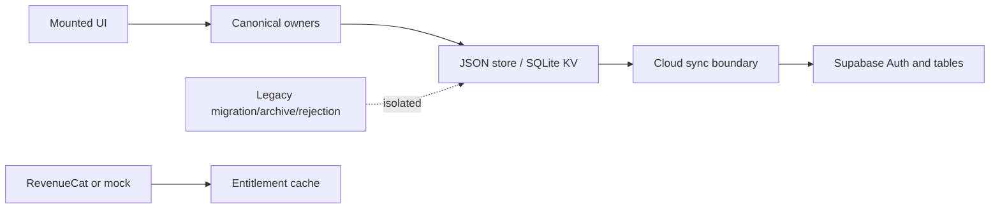

# Data authority map

| Domain | Authority | Conflict rule | Offline / restart |
|---|---|---|---|
| Plan | canonical active-plan carrier and revision | revision/CAS validation | local carrier hydrates; cloud restore is explicit |
| Session lifecycle | canonical ledger/events | aggregate version and operation identity | local ledger persists |
| Prescription | immutable Session Construction snapshot | hash/linkage validation | snapshot retained |
| Evidence/decisions | canonical repositories | identity/version validation | local records persist |
| Preferences | app settings store | normalized last local value | local persistence |
| Entitlement | gateway result + normalized cache | provider response or mock fallback | cached/offline fallback |
| Historical legacy payloads | archive/rejection only | never active authority | retained for migration/diagnostics |

The principal duplication risk is the coexistence of retained legacy repositories and canonical stores. Production reachability certification says mounted authority is canonical; this audit does not delete compatibility data.
