# Coaching loop trace

## End-to-end path

```mermaid
flowchart LR
  A["Onboarding facts"] --> B["Atomic setup command"]
  B --> C["Macrocycle"]
  C --> D["First eligible Mesocycle"]
  D --> E["Microcycle roles and schedule"]
  E --> F["Volume allocation"]
  F --> G["Session Construction v3"]
  G --> H["Canonical carrier persistence"]
  H --> I["Home / Plan / Train"]
  I --> J["Recorded-session ledger"]
  J --> K["Performance + completion evidence"]
  K --> L["Mounted Progress presentation"]
  K -. "no mounted caller" .-> M["Evaluation"]
  M -.-> N["Intervention / decision"]
  N -.-> O["Apply + regenerate future sessions"]
```

The solid production path ends at presentation. The dotted path exists as pure/application code and tests but is not invoked from a mounted route.

## Boundary findings

### 1. Onboarding → planning request

- Contract: `CanonicalGeneratedPlanInput`.
- Identity: deterministic `planId`, timestamps and canonical user choices.
- Defaults introduced: full equipment catalogue is hardcoded; no limitation/preferences intake.
- Persistence: none until construction succeeds.
- Error behaviour: the repaired orchestrator restores prior plan/settings if settings persistence fails.
- Verdict: **PROVEN** for atomicity; **PARTIALLY PROVEN** for personalization.

### 2. Planning request → Macrocycle

- Contract: goal, experience, target date.
- Transformation: `validateCanonicalPlanningActivation`, then `createMacrocycle`.
- Information lost: compatible event type does not survive as an independent canonical fact.
- Error behaviour: impossible timelines/unsupported frameworks/unsafe free-text limitations fail closed.
- Verdict: **PROVEN**.

### 3. Macrocycle → initial Mesocycle

- Transformation: `selectMesocycles(engine, experience)[0]`.
- Information lost: the pathway exists in Macrocycle specs, but selection always takes the first eligible phase.
- Verdict: **PROVEN** for initial phase; **PARTIALLY PROVEN** longitudinally.

### 4. Mesocycle → Microcycle

- Contract: phase ID/policy, days, framework.
- Output: roles, ordering, offsets, stress priority and recovery days.
- Fallback: compatible framework resolution is deterministic.
- Persistence: carrier.
- Verdict: **PROVEN**.

### 5. Microcycle → Session Construction

- Contract: versioned canonical construction input.
- Transformation: region-first volume allocation, exercise suitability/selection, exact targets, load state, rest, method, progression and stop rule.
- Output: immutable v3 snapshot with reason/provenance.
- Error behaviour: invalid allocation, missing suitable exercises, duration infeasibility or invalid carrier fail before persistence.
- Verdict: **PROVEN** for initial construction.

### 6. Session Construction → persistence/presentation

- Persistence: canonical active-plan carrier; snapshots are immutable.
- Home, Plan and Train consume the same session identity and snapshot.
- Duration, set count and exercise count are derived from that snapshot/allocation.
- Verdict: **PROVEN**.

### 7. Train → performed work

- Contract: versioned lifecycle commands with expected plan and ledger revisions.
- Persistence: append-only recorded-session ledger and Progress evidence repository.
- Facts retained: exercise/loading mode/method facts, reps, load, unit, completion and optional effort.
- Missing facts: no mounted pain/readiness entry; current Train has no substitution authoring control.
- Verdict: **PROVEN** for recorded work; **PARTIALLY PROVEN** for coaching evidence breadth.

### 8. Evidence → interpretation

- Actual writer: `canonical-recorded-session-application.ts` lines 65 and 95.
- Expected evaluator inputs: `transitionReady`, `exitCriteriaSatisfied`, `deloadRequired`, or `recoveryState`.
- Actual completion/performance evidence does not derive these flags.
- Mounted Progress calls only `useCanonicalProgressPresentation`.
- Verdict: **CONTRADICTED**.

### 9. Interpretation → next prescription

- Decision production/application code exists and is test-covered.
- No mounted route calls evaluation, production or application.
- Exact load policy is manual-review-only.
- Reconstruction facts lose limitations/history/preferences and miskey loads.
- Verdict: **UNSAFE** even if the missing caller were added without repairing facts.

## Does the loop close?

**No.** Twelve isolated 12–16-week scenarios produced valid deterministic initial plans and actual-shaped evidence. Zero produced a mounted future-prescription adaptation. The pure evaluator returned `continue` for every non-pain scenario because actual evidence does not create transition/deload intent. Pain returned review only because the audit harness explicitly authored pain evidence that mounted Train cannot currently collect.
