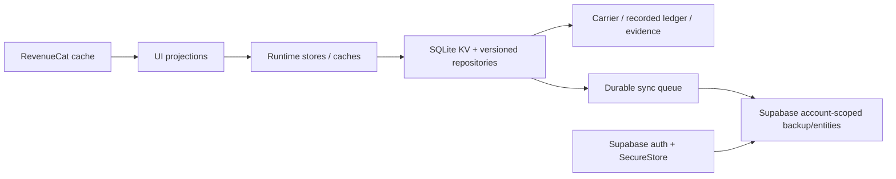

# Persistence authority map

## Count and ownership

There is one native SQLite KV database (`iron-logic-local-storage`) exposed through a synchronous JSON store, at least 24 local repository modules, runtime external-store caches, one durable sync queue, Supabase auth identity, four cloud repository families, and RevenueCat entitlement cache/state. “Authority count” therefore depends on level: **6 persistence layers**, not 24 independent product truths. [repository-derived]

| Layer | Source of truth / schema | Hydration/migration | Conflict/failure |
|---|---|---|---|
| Auth | Supabase session persisted via SecureStore adapter | provider first | offline mode explicit; external persistence unverified |
| SQLite KV | durable native key/value DB; JSON repository schemas | synchronous reads; versioned validators/migrations | native initialization throws, never falls back silently |
| Canonical plan | v2 carrier + owner + revision/CAS | reconciliation before routing | owner mismatch blocks; invalid carrier recovers/blocks |
| Workout/history | recorded session v1 + append/replace events, immutable prescription hash | active restoration and legacy migration paths | idempotent operation/version checks; completed facts separated from future plan |
| Settings/preferences | normalized AppSettings and custom repos | defaults normalized; onboarding transaction | settings restore only if local incomplete/default |
| Coaching state | evidence, decision, intent, attempt, receipt repositories | pending work resumed at startup | fingerprint/CAS/reconciliation; partial commit repair |
| Timer/discard | schema-versioned identity snapshots/intents | absolute clock reconciliation | scoped by workout/set; OS/device gate pending |
| Queue | persisted queue records | recreated on startup | failures retained; entity result counts |
| Cloud | version-1 backup envelope plus custom programme/exercise/workout legacy tables | parallel reads; validate then restore | partial entity failures possible; no global cloud transaction/readback proof |

Deletion/reset paths are scoped repository operations and account deletion services. A complete key-level deletion matrix is not exposed to users; destructive device tests remain required. Backup guarantee is “attempted and counted,” not proven durable until remote readback and second-device restore succeed.
