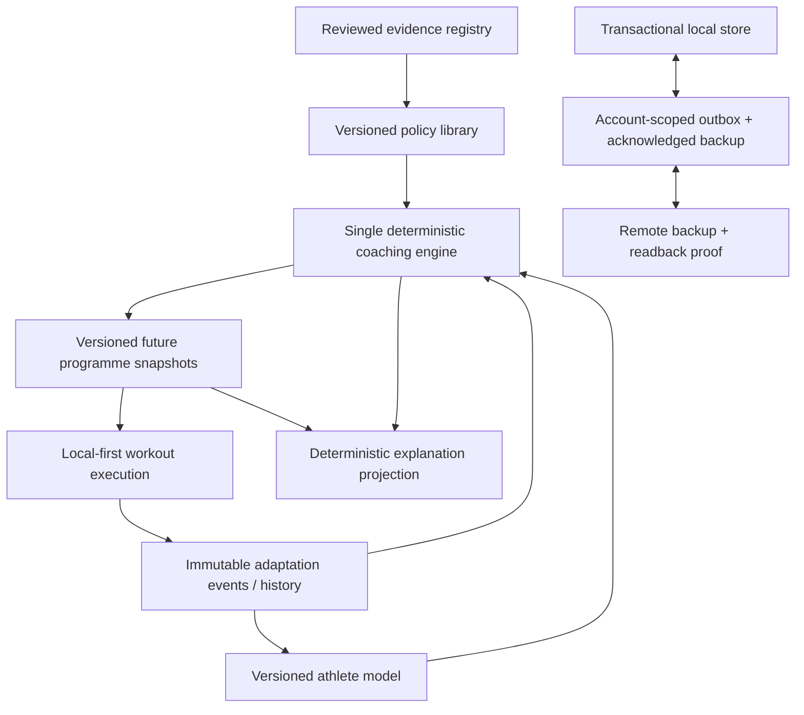

# Target product architecture

Retain and clarify the existing carrier/ledger design; do not rewrite.

## Contracts

- **Single authority:** one command boundary constructs/changes future prescriptions. UI dispatches commands and renders receipts only.
- **Ownership:** auth identity owns remote data; explicit local-only athlete ID; owner mismatch blocks rather than merges.
- **History:** prescription snapshot + append-only performed events; corrections append/replace effective pre-completion evidence with audit lineage; completed records never mutate from future planning.
- **Current vs future:** active workout changes are scoped to recorded session; programme edits create a new future revision and list affected session IDs.
- **Local-first:** opening/logging/completing ordinary workouts never requires network/AI.
- **Sync:** transactional outbox, per-entity idempotency, server acknowledgement, remote readback hash and second-device restore proof; never say “backed up” from enqueue alone.
- **Rules:** registry claim→approved policy→rule version→fingerprinted decision→receipt; deterministic fallback and rollback to last valid carrier.
- **Adapters:** shared domain/application core; iOS/Android adapters for keyboard, back, haptics, billing, secure storage, accessibility and lifecycle.
- **Operations:** feature flags cannot create competing authorities; migrations are recoverable/idempotent; diagnostics are privacy-minimised and read-only; analytics never become prescription truth.

## Source-content boundary

Add no PDF/OCR corpus to the product runtime. Source records and claim candidates belong in an offline governed evidence workflow; approved policies export only original, rights-cleared neutral wording, evidence IDs and deterministic parameters. A template has separate `provenance`, `evidenceBasis`, `rightsStatus` and `policyVersion` fields so historical inspiration cannot masquerade as scientific validation or redistribution permission. The supplied-source pass justifies this boundary but does not authorize a schema or runtime change in the current slice.
